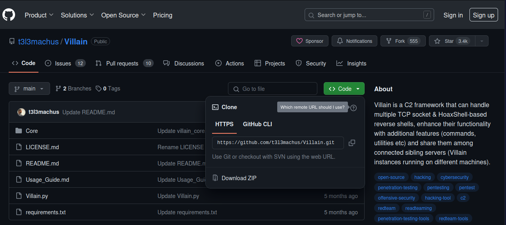
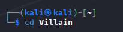
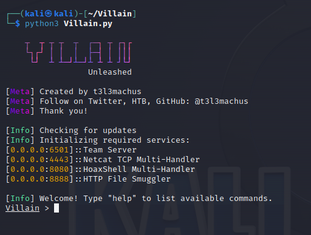
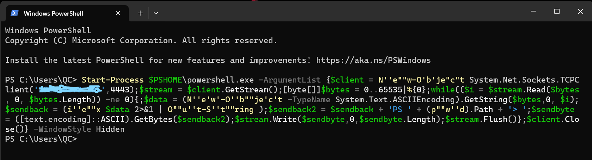
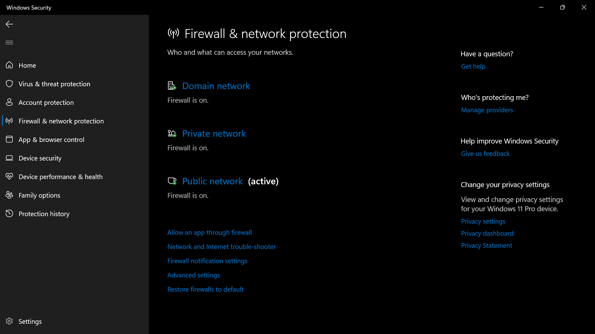
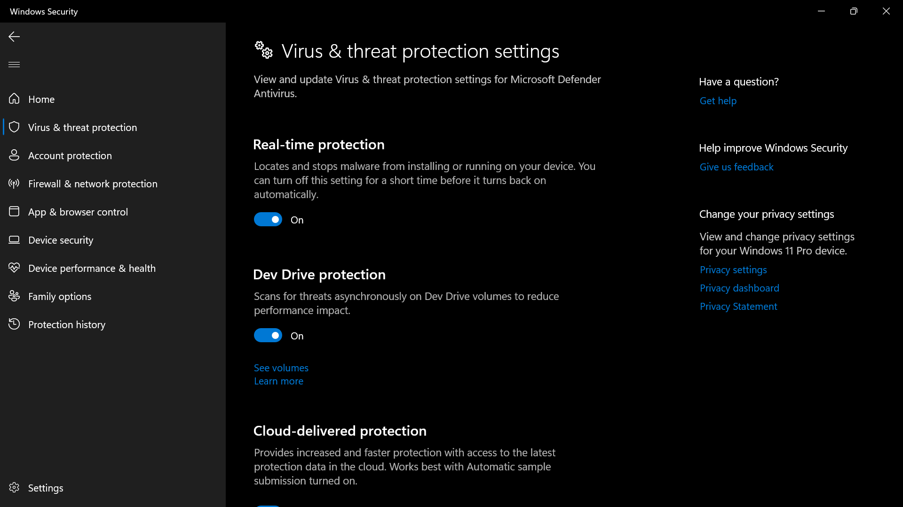

# OpenStack

I will provide a detailed method for deploying **OpenStack** on **CentOS 8**.

## Requirement

- CentOS 8
- VMware
- [Configuration file](https://github.com/RadeelAhmad/OpenStack/tree/main/yum.repos.d)

## Let’s Start…
First of all, you need to configure your VMware according to the following screenshot.

<p align="center">
    
</p>


I set RAM to 32 GB but you set it to 8 GB minimum, depending upon your RAM size, and Processor set to 32.

Add 5 hard drives, 100 GB for CentOS, which is already available starting from 20 GB. Additionally, we need 4 local hard drives for installing various VMs on Open Stack. The sizes of these local hard drives range from 30 GB to 50 GB.

Add 3 network adapters to the CentOS VM configuration in VMware settings. One adapter is already available, and you need to add 2 more.

Your cent OS Network Adapter should be at `NAT` settings
- The second network adapter will be a `HOST-only` setting.
- The third network adapter will be a `bridged` connection.

Make sure to match the configuration with the first screenshot at the top of this article. Name your VM and set the username and password for your CentOS login screen. Leave the other settings as they are. Close the settings and then turn on your VM. The installation process of CentOS is fully automated.

Please ensure that your internet is working properly and that all adapters are functioning correctly. You can check them from the VMware Status bar or the Network panel of CentOS. Currently, ens224 is turned off.

<p align="center">
    
</p>


## CentOS

On your terminal, and get root access. Now use this Command for OpenStack local hostname.

```bash
su
hostnamectl set-hostname openstackio --static
```
`openstackio` is the name. You can use any name of your choice. This execution of the command will set the local hostname only.

<p align="center">
    
</p>

To configure your IP with your local host. I use an ens160 IP address. Use the command to map your IP to the local host. The name for the local host should be the same as set in the previous command. Then use the cat command with directories to verify your mapping:
```bash
echo "192.168.186.131 openstackio" >> /etc/hosts
cat /etc/hosts
```

<p align="center">
    
</p>

Now use these Commands:
```bash
setenforce 0 
sed -i 's/^SELINUX=.*/SELINUX=disabled/g' /etc/selinux/config
```

<p align="center">
    
</p>

Now use following command the following command to install network
```bash
scripts dnf install network-scripts -y
```

<p align="center">
    
</p>

Upon completing this, the following output will be displayed.

<p align="center">
    
</p>

Now use the following back-to-back commands.
```bash
systemctl disable --now firewalld NetworkManager 
systemctl enable --now network 
dnf -y install lvm2
```

<p align="center">
    
</p>

<p align="center">
    
</p>

Upon completing this, the following output will be displayed.

<p align="center">
    
</p>

Now use the following command to check the size and space of the hard drive you added in your VM configuration.
```bash
fdisk -l
```

<p align="center">
    
</p>

Now use these commands for more configuration making tables and groups in free space.

```bash
pvcreate -f /dev/nvme0n2
pvs 
vgcreate -f cinder-volumes /dev/nvme0n2 
vgs 
mkfs.ext4 /dev/nvme0n3 
mkfs.ext4 /dev/nvme0n4
```

<p align="center">
    
</p>

<p align="center">
    
</p>

Now use this Command:

```bash
yum install dnf-plugins-core
```

<p align="center">
    
</p>

Upon completing this, the following output will be displayed.

<p align="center">
    
</p>

Then use the following command to enable some power tools etc.

```bash
yum config-manager --set-enabled powertools
dnf install -y centos-release-openstack-train
```


<p align="center">
    
</p>

<p align="center">
    
</p>

After this, we will utilize the following command to install the necessary and additional packages, which will take some time.
```bash
dnf update –y
```

<p align="center">
    
</p>

Upon completing this, the following output will be displayed.

<p align="center">
    
</p>


Now it’s time to install OpenStack. Use the following command to install OpenStack. 
It will also take some time to download and install packages. Also you need some changes in the configuration file in yum.repos.d

```bash
dnf install -y openstack-packstack
```

<p align="center">
    
</p>

Upon completing this, the following output will be displayed.

<p align="center">
    
</p>

Now use these commands to allow access to file of Configuration.

```bash
packstack --gen-answer-file=answer.txt
```

<p align="center">
    
</p>

Now, use `nano` to edit the configuration file `answer.txt`. Search and make changes to the following lines. Use `ctrl+w` to search and arrows to move the cursor.

- CONFIG_DEFAULT_PASSWORD=admin123
- CONFIG_HEAT_INSTALL=y
- CONFIG_MAGNUM_INSTALL=y
- CONFIG_SSL_CERT_DIR=~/packstackca/
- CONFIG_SSL_CACERT_SELFSIGN=y
- CONFIG_SSL_CERT_SUBJECT_C=ID
- CONFIG_SSL_CERT_SUBJECT_ST=Punjab
- CONFIG_SSL_CERT_SUBJECT_L=Islamabad
- CONFIG_KEYSTONE_ADMIN_PW=admin123
- CONFIG_CINDER_VOLUMES_CREATE=n
- CONFIG_NEUTRON_OVN_BRIDGE_MAPPINGS=extnet:br-ex
- CONFIG_NEUTRON_OVN_BRIDGE_IFACES=br-ex:ens160
- CONFIG_NEUTRON_OVN_BRIDGES_COMPUTE=br-ex
- CONFIG_NOVA_LIBVIRT_VIRT_TYPE=qemu
- CONFIG_HORIZON_SSL=y
- CONFIG_SWIFT_STORAGES=/dev/nvme0n3,/dev/nvme0n4
- CONFIG_SWIFT_STORAGE_REPLICAS=2
- CONFIG_SWIFT_STORAGE_FSTYPE=ext4
- CONFIG_PROVISION_DEMO=n

`admin123` is a sample password. You can use a password of your choice. Press `Ctrl+X` to save and quit the file, then `press Y` to ensure that the file is written successfully and saved. After that, use this command. It will take a bit longer to complete the configuration we have just done.

```bash
packstack --answer-file=answer.txt
```

<p align="center">
    
</p>

After completing this, run the final command.

```bash
dnf install -y wget
```

<p align="center">
    
</p>

You can access your OpenStack on your browser using:

```bash
https://192.168.186.131/dashboard
```

## Note:

Please make sure to use your own IP to access your OpenStack Dashboard. When prompted for login credentials at the OpenStack login screen, use the following:
- **Username**: admin
- **Password**: admin123 (use your own password as per your setup)
